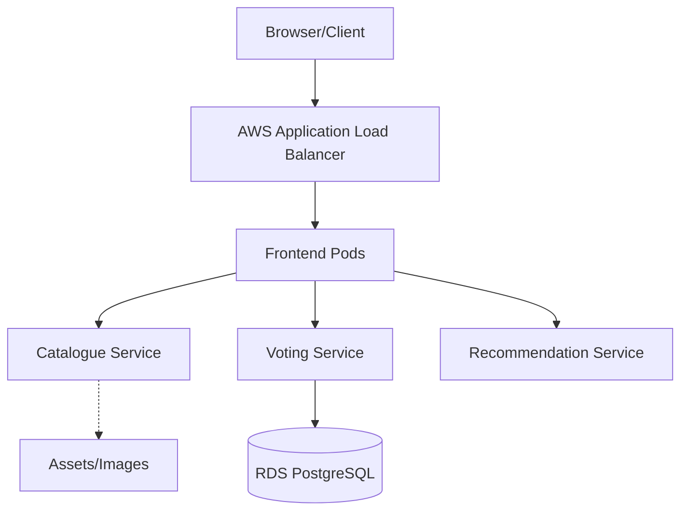

# Craftista Infrastructure (EKS)

This repository contains the **Terraform Infrastructure as Code (IaC)** to provision a production-grade AWS EKS cluster.

> [!NOTE]
> **Application Repository**: The application source code and Helm charts are available at [K8s-demo](https://github.com/Abhin-Anilkumar/K8s-demo).

### Architecture



## Documentation

For detailed technical insights, please refer to:
- **[APPROACH.md](APPROACH.md)**: Design rationale, networking strategy, and architectural decisions.
- **[CHALLENGES.md](CHALLENGES.md)**: A log of hurdles encountered (Architecture mismatches, connectivity hangs) and their resolutions.

## Repository Structure

```text
.
├── terraform/              # Infrastructure as Code (IaC)
│   ├── ENV/prod/           # Production Environment orchestration
│   └── modules/            # Reusable modules (VPC, EKS, RDS, ECR)
├── K8s-demo/               # Application Source & Helm Charts
│   ├── frontend/           # Node.js Frontend
│   ├── catalogue/          # Python Catalogue API
│   ├── voting/             # Java Voting Service
│   └── recommendation/     # Go Recommendation Service
├── APPROACH.md             # Technical rationale
└── CHALLENGES.md           # Issue/Resolution log
```

## Infrastructure Highlights

- **VPC**: Multi-AZ with public/private subnet isolation.
- **EKS**: Managed Kubernetes cluster with a unified node group for simplified networking.
- **IAM (IRSA)**: Least-privilege access for the ALB controller using Service Account annotations.
- **RDS**: Managed PostgreSQL persistence for the voting system.
- **ECR**: Centralized repository for all AMD64-compatible Docker images.

## Getting Started

### Prerequisites

- AWS CLI, Terraform, and kubectl installed.
- Access to an AWS account with EKS and RDS permissions.

### Deployment

1. **Infrastructure**:
   ```bash
   cd terraform/ENV/prod
   terraform init && terraform apply
   ```

2. **Connect to Cluster**:
   ```bash
   aws eks update-kubeconfig --region us-east-1 --name prod-eks
   ```

3. **Deploy Application**:
   Navigate to each directory in `K8s-demo` and deploy using Helm:
   ```bash
   helm install voting ./voting/voting -n app
   # (Repeat for other services)
   ```

## CI/CD Pipeline

The project includes a GitHub Actions pipeline that performs:
- **Terraform Validation**: Ensures code quality and formatting.
- **Microservices Integrity**: (Optional/Planned) Automated linting and Docker build checks.

---
*Note: The Application Load Balancer is configured and ready to provision once account-level ELB creation restrictions are lifted.*
