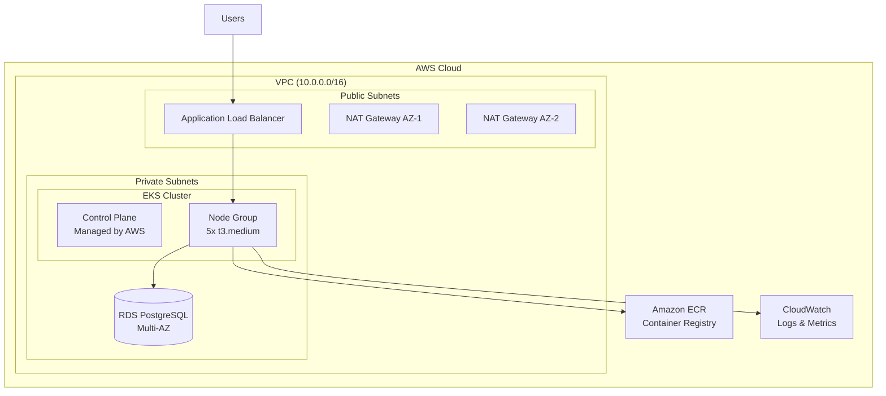

# Craftista Infrastructure - AWS EKS Platform

[](https://www.terraform.io/)
[](https://aws.amazon.com/eks/)
[](LICENSE)

Production-grade Infrastructure as Code (IaC) for deploying a highly available, secure, and cost-optimized Kubernetes cluster on AWS EKS.

> **Application Repository**: [K8s-demo](https://github.com/Abhin-Anilkumar/K8s-demo) - Microservices source code and Helm charts

---

## 📋 Table of Contents

- [Architecture Overview](#architecture-overview)
- [Quick Start](#quick-start)
- [Infrastructure Components](#infrastructure-components)
- [Security Considerations](#security-considerations)
- [Cost Optimization](#cost-optimization)
- [Secret Management](#secret-management)
- [Backup Strategy](#backup-strategy)
- [Monitoring & Logging](#monitoring--logging)
- [Documentation](#documentation)

---

## 🏗️ Architecture Overview



### Key Design Decisions

| Component | Decision | Rationale |
|-----------|----------|-----------|
| **Networking** | Multi-AZ VPC with public/private subnets | High availability and security isolation |
| **Compute** | EKS with single managed node group | Simplified networking, reduced complexity |
| **Node Size** | t3.medium instances | Balance between cost and performance for microservices |
| **Database** | RDS PostgreSQL (Multi-AZ) | Managed service with automated backups and failover |
| **Storage** | EBS CSI Driver with gp2 | Dynamic volume provisioning for stateful workloads |
| **Security** | IRSA (IAM Roles for Service Accounts) | Least-privilege access without long-lived credentials |

---

## 🚀 Quick Start

### Prerequisites

- **AWS CLI** configured with appropriate credentials
- **Terraform** >= 1.0
- **kubectl** >= 1.28
- **Helm** >= 3.0

### 1. Clone the Repository

```bash
git clone https://github.com/Abhin-Anilkumar/EKS-project-for-8byte.git
cd EKS-project-for-8byte
```

### 2. Configure Variables

Edit `terraform/ENV/prod/terraform.tfvars`:

```hcl
aws_region      = "us-east-1"
cluster_name    = "prod-eks"
cluster_version = "1.34"

vpc_cidr = "10.0.0.0/16"
azs      = ["us-east-1a", "us-east-1b"]
```

### 3. Deploy Infrastructure

```bash
cd terraform/ENV/prod

# Initialize Terraform
terraform init

# Review the execution plan
terraform plan

# Apply the configuration
terraform apply
```

**Deployment Time**: ~15-20 minutes

### 4. Configure kubectl

```bash
aws eks update-kubeconfig --name prod-eks --region us-east-1
kubectl get nodes
```

### 5. Deploy Applications

See the [K8s-demo repository](https://github.com/Abhin-Anilkumar/K8s-demo) for application deployment instructions.

---

## 🧩 Infrastructure Components

### VPC Module (`modules/vpc`)
- **CIDR**: 10.0.0.0/16
- **Subnets**: 2 public + 2 private across 2 AZs
- **NAT Gateways**: 2 (one per AZ for high availability)
- **Internet Gateway**: For public subnet internet access

### EKS Module (`modules/eks`)
- **Control Plane**: Managed by AWS (Multi-AZ)
- **Node Group**: 
  - Instance Type: `t3.medium` (2 vCPU, 4GB RAM)
  - Scaling: Min 3, Max 10, Desired 5
  - AMI: Amazon EKS-optimized Linux
- **Add-ons**:
  - AWS EBS CSI Driver (for persistent volumes)
  - VPC CNI (for pod networking)
  - CoreDNS (for service discovery)

### RDS Module (`modules/rds`)
- **Engine**: PostgreSQL 14
- **Instance Class**: db.t3.micro
- **Multi-AZ**: Enabled
- **Automated Backups**: 7-day retention
- **Encryption**: At-rest encryption enabled

### ECR Module (`modules/ecr`)
- **Repositories**: frontend, catalogue, voting, recommendation
- **Scan on Push**: Enabled
- **Lifecycle Policy**: Keep last 10 images

### ALB Controller Module (`modules/alb-controller`)
- **IAM Role**: IRSA-enabled for AWS Load Balancer Controller
- **Deployment**: Helm chart in `kube-system` namespace

### EBS CSI Driver Module (`modules/ebs-csi-driver`)
- **IAM Role**: IRSA-enabled for `ebs-csi-controller-sa`
- **StorageClass**: `gp2` (default)
- **Volume Binding**: WaitForFirstConsumer

---

## 🔒 Security Considerations

### Network Security

1. **Private Subnets**: Worker nodes and RDS in private subnets with no direct internet access
2. **Security Groups**:
   - EKS nodes: Allow traffic only from ALB and within cluster
   - RDS: Allow traffic only from EKS nodes on port 5432
   - ALB: Allow HTTP/HTTPS from internet
3. **Network Policies**: Kubernetes NetworkPolicies for pod-to-pod communication control

### IAM & Access Control

1. **IRSA (IAM Roles for Service Accounts)**:
   - ALB Controller: Permissions to manage ALBs, target groups
   - EBS CSI Driver: Permissions to create/attach EBS volumes
   - No long-lived AWS credentials in pods
2. **Least Privilege**: Each service account has minimal required permissions
3. **RBAC**: Kubernetes Role-Based Access Control for cluster resources

### Data Security

1. **Encryption at Rest**:
   - RDS: Encrypted using AWS KMS
   - EBS Volumes: Encrypted by default
   - EKS Secrets: Encrypted using KMS (cluster encryption config)
2. **Encryption in Transit**:
   - ALB: HTTPS termination (certificate required)
   - RDS: SSL/TLS connections enforced

### Secret Management

- **Kubernetes Secrets**: Database credentials stored as K8s secrets
- **AWS Secrets Manager**: (Optional) For rotating credentials
- **External Secrets Operator**: (Recommended for production) Sync secrets from AWS Secrets Manager

---

## 💰 Cost Optimization

### Current Monthly Estimate: ~$250-300

| Resource | Configuration | Monthly Cost (approx) |
|----------|--------------|----------------------|
| EKS Control Plane | Managed | $73 |
| EC2 Instances | 5x t3.medium | $150 |
| RDS PostgreSQL | db.t3.micro (Multi-AZ) | $30 |
| NAT Gateways | 2x NAT | $65 |
| ALB | 1x Application Load Balancer | $20 |
| EBS Volumes | ~50GB total | $5 |
| Data Transfer | Minimal | $10 |

### Optimization Strategies

1. **Right-Sizing**:
   - Selected `t3.medium` instances based on actual workload requirements
   - Horizontal Pod Autoscaler (HPA) to scale pods, not nodes unnecessarily

2. **Spot Instances** (Future):
   - Can reduce costs by 70% for stateless workloads
   - Configure mixed instance types with Spot and On-Demand

3. **Auto-Scaling**:
   - Cluster Autoscaler configured (min: 3, max: 10)
   - Scales down during low traffic periods

4. **Resource Limits**:
   - All pods have CPU/memory requests and limits
   - Prevents resource waste and enables efficient bin-packing

5. **Storage Optimization**:
   - EBS gp2 volumes (cost-effective for moderate IOPS)
   - Lifecycle policies for ECR images (keep last 10)

6. **Reserved Instances** (Production):
   - 1-year Reserved Instances for baseline capacity (40% savings)

---

## 🔐 Secret Management

### Current Implementation

**Kubernetes Secrets** for database credentials:

```bash
# Secret created manually
kubectl create secret generic voting-db-credentials \
  --from-literal=username=postgres \
  --from-literal=password=<RDS_PASSWORD> \
  -n app

# Replicated to staging
kubectl create secret generic voting-db-credentials \
  --from-literal=username=postgres \
  --from-literal=password=<RDS_PASSWORD> \
  -n stage-app
```

### Best Practices Implemented

1. **No Hardcoded Secrets**: Credentials not stored in code or Helm values
2. **Namespace Isolation**: Secrets scoped to specific namespaces
3. **RBAC**: Only voting service pods can access the secret
4. **Encryption**: Secrets encrypted at rest using EKS encryption config

### Recommended Enhancements

1. **AWS Secrets Manager Integration**:
   ```bash
   # Install External Secrets Operator
   helm install external-secrets external-secrets/external-secrets -n external-secrets-system
   ```

2. **Secret Rotation**: Automated rotation using AWS Secrets Manager

---

## 💾 Backup Strategy

### RDS Automated Backups

**Configuration** (in `modules/rds/main.tf`):
```hcl
backup_retention_period = 7  # 7-day retention
backup_window          = "03:00-04:00"  # Daily at 3 AM UTC
maintenance_window     = "Mon:04:00-Mon:05:00"
```

**Features**:
- **Point-in-Time Recovery**: Restore to any point within the 7-day window
- **Multi-AZ**: Automated failover to standby in case of AZ failure
- **Snapshots**: Manual snapshots can be taken for long-term retention

### Terraform State Backup

**Backend Configuration** (`terraform/ENV/prod/backend.tf`):
```hcl
terraform {
  backend "s3" {
    bucket         = "abhin25"
    key            = "terraform/state"
    region         = "us-east-1"
    dynamodb_table = "terraform-locks"
    encrypt        = true
  }
}
```

**Features**:
- **Versioning**: S3 bucket versioning enabled
- **State Locking**: DynamoDB prevents concurrent modifications
- **Encryption**: State file encrypted at rest

### Application Data Backup

**Persistent Volumes** (Prometheus, Grafana):
- **EBS Snapshots**: Automated via AWS Backup (recommended)
- **Retention**: 30-day retention policy

**Recommended Backup Schedule**:
```bash
# Install Velero for Kubernetes backup
velero install \
  --provider aws \
  --bucket craftista-k8s-backups \
  --backup-location-config region=us-east-1 \
  --snapshot-location-config region=us-east-1
```

---

## 📊 Monitoring & Logging

### Metrics (Prometheus + Grafana)

- **Prometheus**: Deployed in `monitoring` namespace
- **Grafana**: Accessible via port-forward on port 3000
- **Dashboards**: 
  - Infrastructure Overview (CPU, Memory, Disk, Network)
  - Application Performance (Pod metrics, restarts, availability)

### Centralized Logging (CloudWatch)

**Log Groups**:
- `/aws/eks/prod-eks/cluster`: EKS control plane logs

**Access Logs**:
```bash
# View control plane logs
aws logs tail /aws/eks/prod-eks/cluster --follow
```

---

## 📚 Documentation

- **[WALKTHROUGH.md](complete-walkthrough.md)**: **Complete step-by-step technical walkthrough** - Detailed explanation of every component, code, and deployment step
- **[APPROACH.md](APPROACH.md)**: Detailed design rationale and architectural decisions
- **[CHALLENGES.md](CHALLENGES.md)**: Issues encountered and resolutions
- **[Application README](https://github.com/Abhin-Anilkumar/K8s-demo/blob/main/README.md)**: Microservices deployment guide

---

## 🤝 Contributing

1. Fork the repository
2. Create a feature branch (`git checkout -b feature/amazing-feature`)
3. Commit your changes (`git commit -m 'Add amazing feature'`)
4. Push to the branch (`git push origin feature/amazing-feature`)
5. Open a Pull Request

---

## 📝 License

This project is licensed under the MIT License - see the [LICENSE](LICENSE) file for details.

---

## 👤 Author

**Abhin Anilkumar**
- GitHub: [@Abhin-Anilkumar](https://github.com/Abhin-Anilkumar)
- Project: [EKS Infrastructure](https://github.com/Abhin-Anilkumar/EKS-project-for-8byte)
